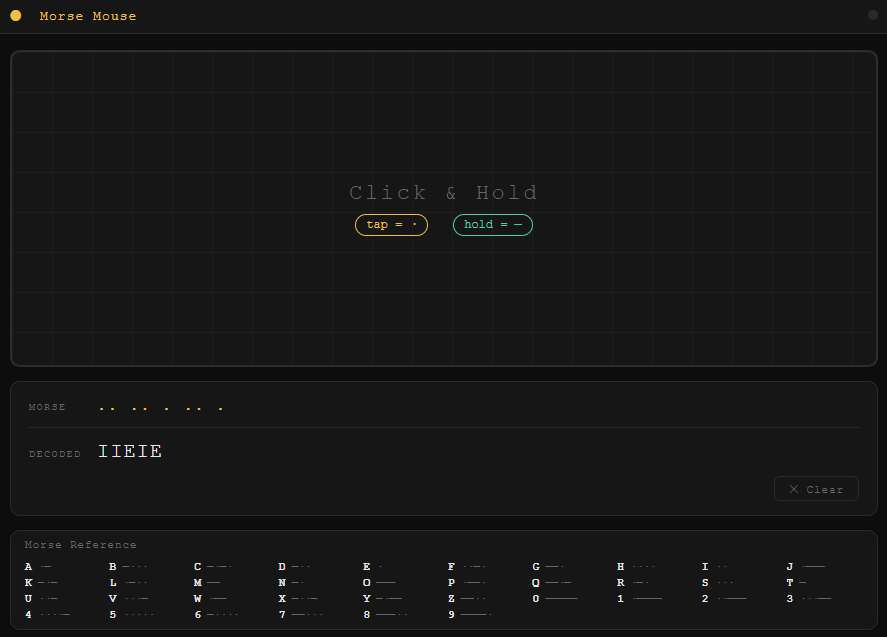

# 🖱️ Morse Mouse

A minimal, interactive desktop app that turns your mouse into a Morse code input device.
Click and hold to send signals — see them decoded into text in real time.



---

## ✨ Features

- **Mouse-driven input** — tap for a dot, hold for a dash
- **Real-time decoding** — Morse symbols are decoded as you type
- **Audio feedback** — short beep for dots, long beep for dashes (Web Audio API)
- **Visual ripple effects** — click animations on the input zone
- **Auto letter/word detection** — pauses automatically commit letters and words
- **Morse reference sheet** — built-in collapsible cheat-sheet (A–Z, 0–9)
- **Dark terminal UI** — minimal, distraction-free design

---

## 🧠 How It Works

| Action | Result |
|---|---|
| Short click (< 200 ms) | Dot ` · ` |
| Hold click (≥ 200 ms) | Dash ` — ` |
| 600 ms silence | Current letter committed |
| 1 400 ms silence | Word space added |
| Click **✕ Clear** | Reset all output |

### Timing (configurable in `renderer/app.js`)

```js
DOT_THRESHOLD = 200    // ms — shorter = dot, longer = dash
LETTER_PAUSE  = 600    // ms — silence before letter is committed
WORD_PAUSE    = 1400   // ms — silence before a space is added
```

---

## 🚀 Getting Started

### Prerequisites

- [Node.js](https://nodejs.org/) 18+
- npm

### Install

```bash
git clone https://github.com/duckvhuynh/mouse-morse.git
cd mouse-morse
npm install
```

### Run

```bash
npm start
```

### Build a distributable

```bash
npm run build
```

Output is placed in the `dist/` folder.

---

## 📁 Project Structure

```
mouse-morse/
├── main.js          # Electron main process — creates the BrowserWindow
├── preload.js       # Secure context bridge (contextIsolation enabled)
├── package.json
└── renderer/
    ├── index.html   # UI shell
    ├── app.js       # Input handling, pause detection, audio, ripple effects
    ├── morse.js     # Morse encode/decode (A–Z, 0–9, punctuation)
    └── styles.css   # Dark terminal theme
```

---

## 🏗️ Tech Stack

| Layer | Technology |
|---|---|
| Desktop shell | [Electron](https://www.electronjs.org/) |
| Core logic | Vanilla JavaScript (ES Modules) |
| Audio | Web Audio API |
| UI | HTML + CSS |
| Build | electron-builder |

---

## 🧪 Future Ideas

- **Training mode** — show a target word and score your input by accuracy and speed
- **Multiplayer** — real-time Morse chat over WebSocket
- **Keyboard mode** — use spacebar as the input key instead of mouse
- **Export** — copy decoded text to clipboard with one click

---

## 📜 License

MIT
